## 项目

| 项目 | 研究方向 | 已实现内容 |
|---|---|---|
| [wavrail](https://github.com/StarWorkshop/wavrail) | 流式语音识别 | WAV I/O 与帧化、log-mel 特征、CTC 贪心/前缀束解码、transducer 式帧同步发射、强制对齐、中英文 CER/WER、分块流式管线与延迟核算、合成音频上的可训练声学模型 |
| [dialogvox](https://github.com/StarWorkshop/dialogvox) | 端到端语音对话 | RVQ 神经音频编解码、语音-文本统一 token、紧凑对话 LM 与联合损失、KV-cache 流式生成与有界缓冲、外部语音大模型适配器协议、回合级评测与可复现报告 |

两个项目都包含命令行工具、可运行示例、契约/黄金测试和 CPU 模型测试，全部离线可复现。

## 技术栈

## 活动

<picture>
  <source media="(prefers-color-scheme: dark)" srcset="https://raw.githubusercontent.com/StarWorkshop/StarWorkshop/output/github-snake-dark.svg" />
  <source media="(prefers-color-scheme: light)" srcset="https://raw.githubusercontent.com/StarWorkshop/StarWorkshop/output/github-snake.svg" />
  
</picture>

## 当前关注

- 流式识别的延迟核算：算法延迟 vs 发射延迟，分块与离线输出的等价性。
- 语音-文本统一 token 上的联合建模、KV-cache 流式解码与背压语义。
- 合成数据上的可复现训练链路：种子、锁文件与逐提交检查。
